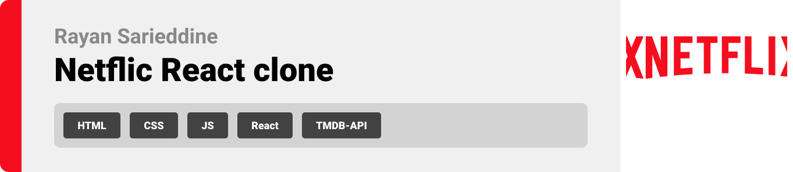
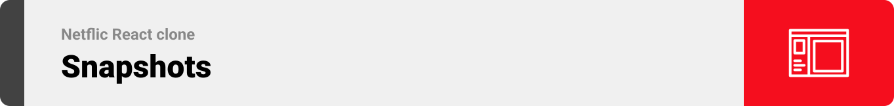
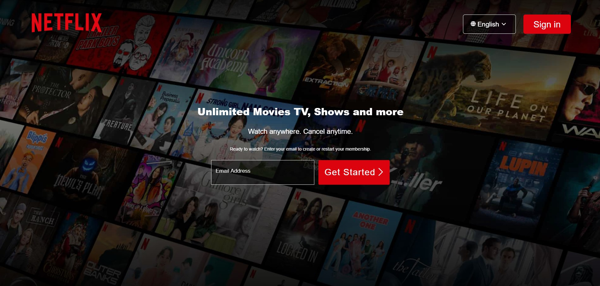
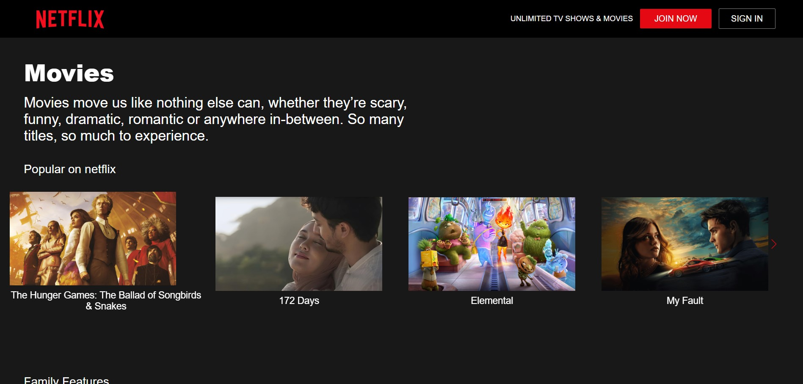
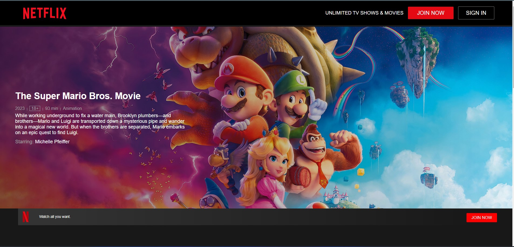

  

<!-- project philosophy -->

## This is my attempt of cloning netflix's website accessible at https://www.netflix.com/ using HTML, CSS and react with the help of TMDB API

  

<!-- Prototyping -->

| 
| 
| 
